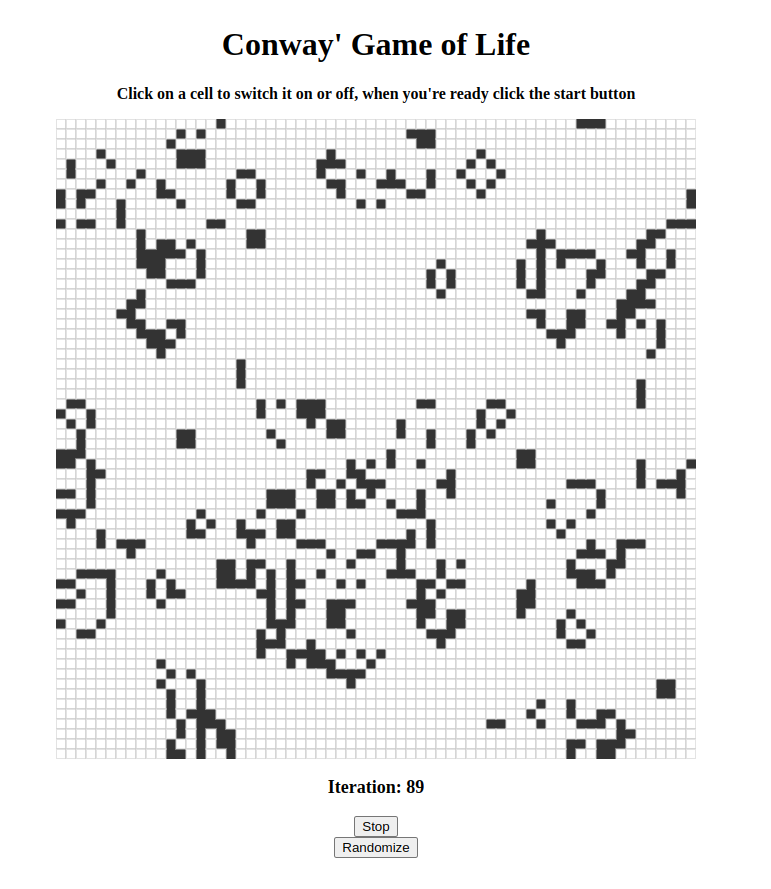

# Some simple simulation projects

This repository contains some simple simulation projects.

For now it contains:

1. Simple Cellular Automata simulation, parity rule, and Conway's Game of Life built with P5.js

## Usage

Navigate to "frontend" directory and run `npm install` once that's done run `npm start`.